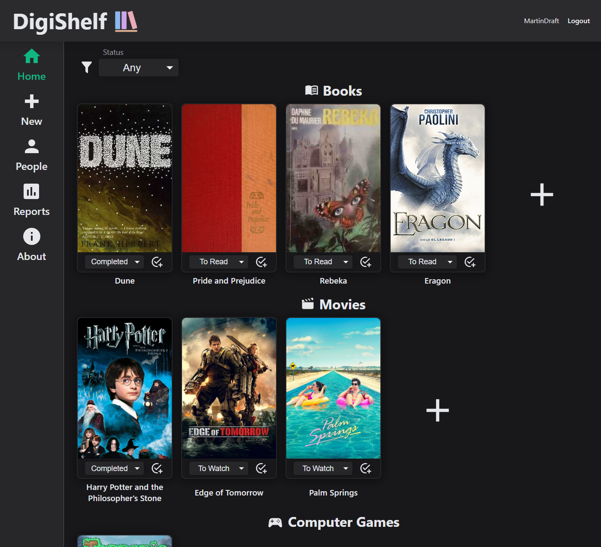
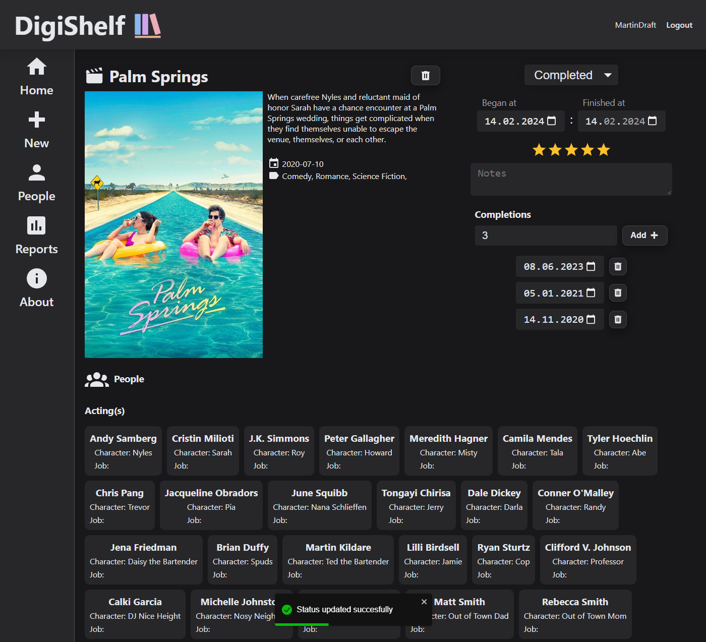
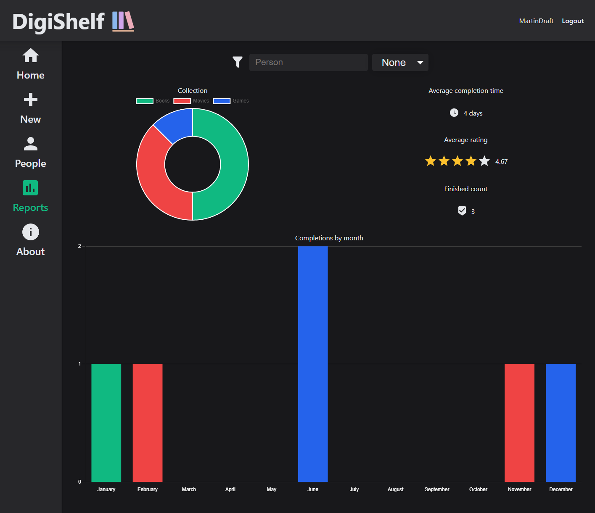

Application created as practical part of engineering thesis on subject: "Application for collecting information about popculture". Its a web app where user can keep track on his collection of books, movies and games.

## Features

-   Adding works from API
-   Creating works by user
-   Updating user status on work
-   Generating reports about user collection

## Showcase

 

 

## Copyright

Digishelf app by [Marcin Skic, Marcin Skrzypek, Ewa Solarska](https://github.com/pollubMsMsEs) is licensed under
<a href="http://creativecommons.org/licenses/by-nc-nd/4.0/?ref=chooser-v1" target="_blank" rel="license noopener noreferrer">CC BY-NC-ND 4.0

</a>

---

### Used technologies

[<picture align="left" ><source media="(prefers-color-scheme: light)" srcset="https://api.iconify.design/simple-icons:express.svg?color=%23000000" /></picture>](https://expressjs.com)

